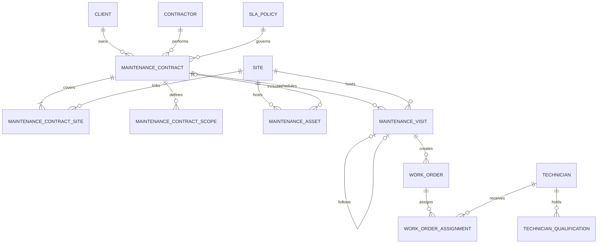
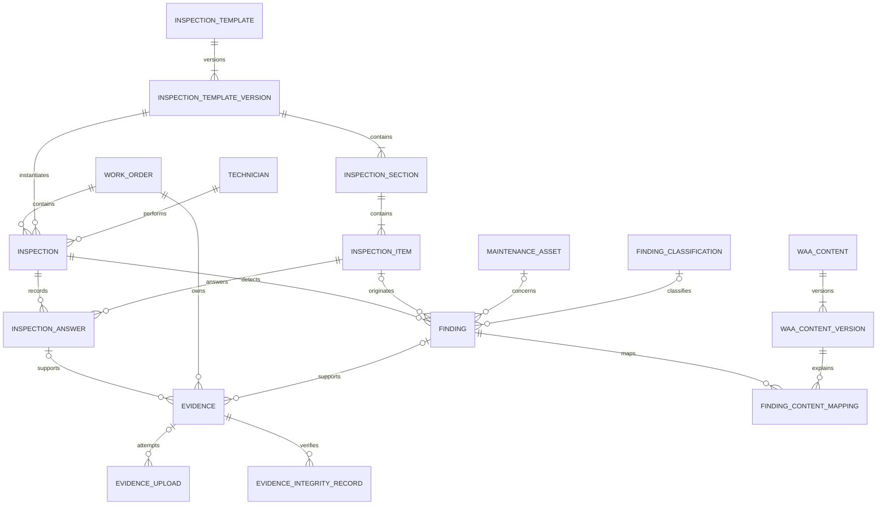
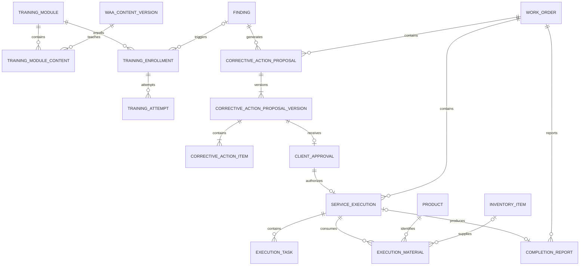
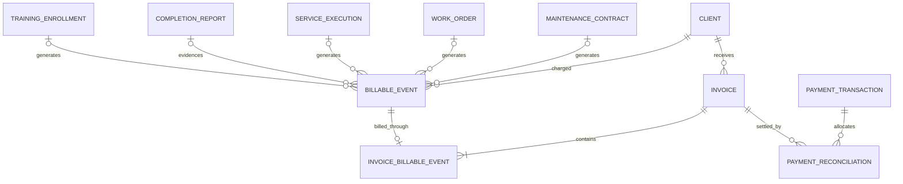

# Mostaofi v1.1 — Final ERD Baseline

| الحقل | القيمة |
|---|---|
| Baseline ID | `MOSTAOFI-V1.1-ERD-BASELINE-001` |
| Status | `FROZEN_FOR_IMPLEMENTATION` |
| Freeze date | 2026-09-03 UTC |
| النطاق | ERD وعقد البيانات فقط |
| المرحلة التالية | OpenAPI v1.1 — مقفلة إلى حين اعتماد هذا الملف بعينه |

## 1. قرار التجميد

هذا الملف هو المرجع الحاكم لنموذج بيانات Mostaofi v1.1. المسار التشغيلي المعتمد هو:

`MaintenanceContract → MaintenanceVisit → WorkOrder → Inspection → Finding → Evidence / Waa’iyah → CorrectiveActionProposalVersion → ClientApproval → ServiceExecution → CompletionReport → BillableEvent → Invoice / Collection → New MaintenanceVisit`

القرارات الثلاثة غير القابلة للعكس داخل v1.1:

1. الزيارة التالية ليست كيانًا مستقلًا؛ هي سجل جديد في `maintenance_visit` مرتبط عبر `previous_visit_id` و`visit_sequence`.
2. محتوى Waa’iyah نطاق مستقل بإصدارات غير قابلة للتعديل بعد النشر، وعلاقته مع `finding` هي N:M عبر `finding_content_mapping`.
3. الفوترة مبنية على `billable_event` وليست علاقة مباشرة 1:1 بين التقرير والفاتورة.

لا يتضمن هذا الخط الأساس endpoints أو RBAC أو DTOs أو تفاصيل S0–S10.

## 2. قواعد البيانات الحاكمة

### 2.1 الأعمدة المشتركة

كل جدول جديد مملوك لمستأجر يحمل، حتى لو اختُصرت في الرسومات:

| العمود | النوع | القاعدة |
|---|---|---|
| `id` | `uuid` | PK، يولد من النظام |
| `tenant_id` | `uuid` | NOT NULL، FK إلى `tenant.id` |
| `created_at` | `timestamptz` | NOT NULL، UTC |
| `created_by` | `uuid` | FK إلى `user.id`، NULL فقط لعملية نظام موثقة |
| `updated_at` | `timestamptz` | NOT NULL، UTC |
| `updated_by` | `uuid` | FK إلى `user.id`، NULL فقط لعملية نظام موثقة |

جداول الربط التي كانت معرفة بمفتاح مركب فقط تحصل أيضًا على `id uuid PK`، ويصبح الزوج السابق `UNIQUE`. ينطبق ذلك على `training_module_content` و`invoice_billable_event`.

الاستثناء الوحيد من `tenant_id NOT NULL` هو محتوى المنصة العالمي: `waa_content` و`waa_content_version` و`training_module` و`training_module_content`. القيمة `NULL` تعني محتوى عالميًا للقراءة فقط من المستأجرين، والكتابة عليه محصورة بإدارة المنصة. المحتوى الخاص بمستأجر يحمل `tenant_id` لذلك المستأجر.

### 2.2 الأنواع

- كل المعرفات UUID فقط.
- كل الأزمنة `timestamptz` وتحفظ UTC؛ `timezone` اسم IANA ويستخدم للعرض وحساب ساعات العمل فقط.
- التواريخ المجردة مثل بداية العقد ونهايته من نوع `date`.
- المال `numeric(19,4)`، والعملة `char(3)` برمز ISO 4217؛ يمنع `float`.
- الكميات `numeric(19,4)`، العدادات `integer` أو `bigint` حسب الحقل.
- `file_size` من نوع `bigint` وغير سالب، و`sha256` من نوع `char(64)` lowercase hex.
- الحقول المرنة المصرح بها فقط هي `jsonb`: `working_hours_policy` وحقول metadata/payload/answer المحددة.
- الحالات Enums محكومة. `scope_category` و`service_type` أكواد إعداد قابلة للتهيئة وليستا PostgreSQL enums.

### 2.3 العزل المرجعي

وجود `tenant_id` وحده لا يكفي. كل جدول مملوك لمستأجر يعلن `UNIQUE (tenant_id, id)`، وكل علاقة داخلية تستخدم FK مركبًا بالشكل:

`FOREIGN KEY (tenant_id, parent_id) REFERENCES parent (tenant_id, id)`

وتفعل PostgreSQL Row-Level Security بسياسة fail-closed. يمنع أي FK أو قراءة أو كتابة عابرة للمستأجر. العلاقات مع المحتوى العالمي تستخدم constraint trigger يسمح فقط بأن يكون مالك المحتوى `NULL` أو مساويًا لمستأجر السجل التشغيلي.

### 2.4 الحذف والثبات

- لا hard delete لأي سجل تشغيلي مدقق بعد دخوله دورة العمل.
- `audit_event` append-only.
- `domain_event` append-only في محتواه؛ حقول النشر التشغيلية فقط قابلة للتحديث.
- `inspection_template_version` بعد `PUBLISHED` غير قابل للتعديل.
- `waa_content_version` بعد `PUBLISHED` غير قابل للتعديل.
- نسخة العرض بعد إرسالها، وكل نسخة تمت الموافقة عليها، غير قابلة للتعديل.
- `evidence` بعد `FINALIZED` لا يتغير `object_key` أو `sha256` أو محتوى الملف.
- `completion_report` بعد `FINALIZED` غير قابل للتعديل.

## 3. اعتماد Core v1.0

تعاد الاستفادة من الكيانات التالية دون إنشاء نسخ v1.1:

`tenant`, `user`, `client`, `contractor`, `site`, `product`, `inventory_item`, `audit_event`, `document`, `payment_transaction`.

يضاف `invoice` في v1.1 لأن قائمة Core المعتمدة لا تثبت وجوده. إذا ثبت قبل migration أن Core يملك Invoice مطابقًا لهذا العقد، يعاد استخدام هويته نفسها ولا ينشأ جدول موازٍ.

## 4. قاموس الكيانات النهائي

الأعمدة المشتركة في §2.1 ضمنية في كل كيان أدناه.

### 4.1 القوى الفنية والعقود

| الجدول | الأعمدة الخاصة |
|---|---|
| `technician` | `contractor_id uuid FK`, `user_id uuid FK NULL`, `employee_code text`, `display_name text`, `mobile text`, `status technician_status` |
| `technician_qualification` | `technician_id uuid FK`, `qualification_type text`, `qualification_code text`, `issued_at date`, `expires_at date`, `status qualification_status`, `evidence_document_id uuid FK NULL` |
| `sla_policy` | `name text`, `version integer`, `response_target_minutes integer`, `arrival_target_minutes integer`, `resolution_target_minutes integer`, `working_hours_policy jsonb`, `timezone text`, `status sla_policy_status`, `effective_from date`, `effective_to date NULL` |
| `maintenance_contract` | `contract_number text`, `client_id uuid FK`, `contractor_id uuid FK`, `contract_type text`, `start_date date`, `end_date date`, `planned_visits integer`, `completed_visits integer`, `visit_frequency_type text`, `visit_frequency_value integer`, `contract_value numeric(19,4)`, `vat_amount numeric(19,4)`, `total_value numeric(19,4)`, `currency char(3)`, `sla_policy_id uuid FK`, `status maintenance_contract_status`, `activated_at timestamptz NULL`, `suspended_at timestamptz NULL`, `closed_at timestamptz NULL` |
| `maintenance_contract_site` | `contract_id uuid FK`, `site_id uuid FK`, `is_active boolean` |
| `maintenance_contract_scope` | `contract_id uuid FK`, `scope_category text`, `service_type text`, `description text`, `included boolean`, `visit_limit integer NULL`, `notes text NULL` |
| `maintenance_asset` | `site_id uuid FK`, `contract_id uuid FK NULL`, `asset_code text`, `asset_type text`, `manufacturer text`, `model text`, `serial_number text NULL`, `installation_date date NULL`, `commissioned_at timestamptz NULL`, `location_description text`, `status maintenance_asset_status` |

### 4.2 الزيارات وأوامر العمل

| الجدول | الأعمدة الخاصة |
|---|---|
| `maintenance_visit` | `contract_id uuid FK`, `site_id uuid FK`, `previous_visit_id uuid FK NULL`, `visit_sequence integer`, `visit_kind maintenance_visit_kind`, `scheduled_start timestamptz`, `scheduled_end timestamptz`, `confirmed_at timestamptz NULL`, `actual_arrival_at timestamptz NULL`, `actual_start_at timestamptz NULL`, `actual_end_at timestamptz NULL`, `status maintenance_visit_status`, `reschedule_reason text NULL` |
| `work_order` | `work_order_number text`, `contract_id uuid FK`, `visit_id uuid FK`, `site_id uuid FK`, `contractor_id uuid FK`, `service_type text`, `priority work_order_priority`, `scheduled_start timestamptz`, `sla_deadline timestamptz NULL`, `actual_start_at timestamptz NULL`, `actual_completion_at timestamptz NULL`, `status work_order_status` |
| `work_order_assignment` | `work_order_id uuid FK`, `technician_id uuid FK`, `role assignment_role`, `assigned_at timestamptz`, `accepted_at timestamptz NULL`, `released_at timestamptz NULL`, `status assignment_status`, `assigned_by uuid FK → user.id` |

### 4.3 قوالب الفحص ونسخ الفحص

| الجدول | الأعمدة الخاصة |
|---|---|
| `inspection_template` | `name text`, `service_type text`, `status inspection_template_status` |
| `inspection_template_version` | `template_id uuid FK`, `version_number integer`, `status inspection_template_version_status`, `effective_from date NULL`, `published_at timestamptz NULL` |
| `inspection_section` | `template_version_id uuid FK`, `title text`, `display_order integer` |
| `inspection_item` | `section_id uuid FK`, `code text`, `question text`, `answer_type inspection_answer_type`, `required boolean`, `requires_evidence_on_fail boolean`, `display_order integer` |
| `inspection` | `work_order_id uuid FK`, `template_version_id uuid FK`, `started_at timestamptz`, `completed_at timestamptz NULL`, `performed_by uuid FK → technician.id`, `status inspection_status` |
| `inspection_answer` | `inspection_id uuid FK`, `inspection_item_id uuid FK`, `answer_boolean boolean NULL`, `answer_number numeric NULL`, `answer_text text NULL`, `answer_json jsonb NULL`, `result inspection_answer_result`, `recorded_at timestamptz`, `recorded_by uuid FK → technician.id` |

### 4.4 Findings والتصنيف والأدلة

| الجدول | الأعمدة الخاصة |
|---|---|
| `finding_classification` | `code text`, `classification_type text`, `title text`, `description text`, `reference_source text NULL`, `reference_version text NULL`, `reference_section text NULL`, `status finding_classification_status`, `effective_from date NULL`, `effective_to date NULL` |
| `finding` | `work_order_id uuid FK`, `inspection_id uuid FK`, `inspection_item_id uuid FK NULL`, `asset_id uuid FK NULL`, **`finding_classification_id uuid FK NULL`**, `finding_type finding_type`, `category text`, `title text`, `description text`, `severity finding_severity`, `risk_level text`, `status finding_status`, `detected_by uuid FK → technician.id`, `detected_at timestamptz`, `resolved_at timestamptz NULL`, `verified_at timestamptz NULL` |
| `evidence` | `work_order_id uuid FK`, `inspection_id uuid FK NULL`, `inspection_answer_id uuid FK NULL`, `finding_id uuid FK NULL`, `execution_id uuid FK NULL`, `evidence_type evidence_type`, `object_key text`, `mime_type text`, `file_size bigint`, `sha256 char(64)`, `captured_at timestamptz`, `captured_by uuid FK → technician.id`, `latitude numeric(9,6) NULL`, `longitude numeric(10,6) NULL`, `device_metadata_json jsonb NULL`, `status evidence_status` |
| `evidence_upload` | `evidence_id uuid FK NULL`, `upload_token_hash char(64)`, `object_key text`, `expected_sha256 char(64) NULL`, `status evidence_upload_status`, `retry_count integer`, `started_at timestamptz`, `completed_at timestamptz NULL`, `failed_at timestamptz NULL`, `last_error_code text NULL` |
| `evidence_integrity_record` | `evidence_id uuid FK`, `sha256 char(64)`, `verified_at timestamptz`, `verification_method text`, `verified_by uuid FK → user.id NULL` |

ملاحظة أمنية: يخزن hash لرمز الرفع لا الرمز الخام. `severity` لا تمنح صلاحية إيقاف نشاط أو منشأة ولا يستنتج منها قرار shutdown.

### 4.5 Waa’iyah والتدريب

| الجدول | الأعمدة الخاصة |
|---|---|
| `waa_content` | `tenant_id uuid NULL`, `content_code text`, `category text`, `content_type text`, `language text`, `status waa_content_status` |
| `waa_content_version` | `tenant_id uuid NULL`, `content_id uuid FK`, `version_number integer`, `title text`, `summary text`, `body text`, `risk_explanation text`, `verification_method text`, `corrective_guidance text`, `media_document_id uuid FK NULL`, `status waa_content_version_status`, `reviewed_by uuid FK → user.id NULL`, `approved_by uuid FK → user.id NULL`, `approved_at timestamptz NULL`, `published_at timestamptz NULL` |
| `finding_content_mapping` | `finding_id uuid FK`, `content_version_id uuid FK`, `relevance_score numeric NULL`, `priority integer`, `mapped_by uuid FK → user.id`, `mapped_at timestamptz` |
| `training_module` | `tenant_id uuid NULL`, `code text`, `title text`, `status training_module_status` |
| `training_module_content` | `tenant_id uuid NULL`, `training_module_id uuid FK`, `content_version_id uuid FK`, `display_order integer` |
| `training_enrollment` | `training_module_id uuid FK`, `client_id uuid FK NULL`, `user_id uuid FK NULL`, `work_order_id uuid FK NULL`, `finding_id uuid FK NULL`, `status training_enrollment_status`, `enrolled_at timestamptz`, `completed_at timestamptz NULL` |
| `training_attempt` | `enrollment_id uuid FK`, `attempt_number integer`, `score numeric NULL`, `passing_score numeric`, `passed boolean NULL`, `started_at timestamptz`, `completed_at timestamptz NULL` |

### 4.6 العرض والإقرار والتنفيذ

| الجدول | الأعمدة الخاصة |
|---|---|
| `corrective_action_proposal` | `finding_id uuid FK`, `work_order_id uuid FK`, `client_id uuid FK`, `proposal_number text`, `status corrective_proposal_status`, `current_version_id uuid FK NULL` |
| `corrective_action_proposal_version` | `proposal_id uuid FK`, `version_number integer`, `solution_type solution_type`, `scope_description text`, `estimated_duration_minutes integer NULL`, `subtotal numeric(19,4)`, `vat_amount numeric(19,4)`, `total_amount numeric(19,4)`, `currency char(3)`, `payment_requirement text`, `advance_amount numeric(19,4) NULL`, `valid_until timestamptz NULL` |
| `corrective_action_item` | `proposal_version_id uuid FK`, `item_type corrective_item_type`, `product_id uuid FK NULL`, `description text`, `quantity numeric(19,4)`, `unit text`, `unit_price numeric(19,4)`, `subtotal numeric(19,4)`, `vat_amount numeric(19,4)`, `total numeric(19,4)` |
| `client_approval` | `proposal_version_id uuid FK`, `decision client_approval_decision`, `approved_amount numeric(19,4) NULL`, `decision_reason text NULL`, `client_user_id uuid FK → user.id`, `decided_at timestamptz`, `approval_evidence_id uuid FK NULL` |
| `service_execution` | `work_order_id uuid FK`, `proposal_version_id uuid FK`, `approval_id uuid FK`, `status service_execution_status`, `authorized_at timestamptz NULL`, `started_at timestamptz NULL`, `completed_at timestamptz NULL` |
| `execution_task` | `execution_id uuid FK`, `description text`, `assigned_technician_id uuid FK NULL`, `status execution_task_status`, `started_at timestamptz NULL`, `completed_at timestamptz NULL` |
| `execution_material` | `execution_id uuid FK`, `product_id uuid FK`, `inventory_item_id uuid FK NULL`, `quantity_required numeric(19,4)`, `quantity_reserved numeric(19,4)`, `quantity_issued numeric(19,4)`, `quantity_used numeric(19,4)`, `quantity_returned numeric(19,4)` |

### 4.7 التقرير والفوترة والتحصيل

| الجدول | الأعمدة الخاصة |
|---|---|
| `completion_report` | `work_order_id uuid FK`, `execution_id uuid FK NULL`, `report_number text`, `inspection_summary text`, `work_summary text`, `recommendations text`, `remaining_risk text`, `status completion_report_status`, `generated_at timestamptz NULL`, `technician_signed_at timestamptz NULL`, `client_acknowledged_at timestamptz NULL`, `document_id uuid FK NULL` |
| `billable_event` | `client_id uuid FK`, `contract_id uuid FK NULL`, `work_order_id uuid FK NULL`, `execution_id uuid FK NULL`, `report_id uuid FK NULL`, `training_enrollment_id uuid FK NULL`, `event_type billable_event_type`, `event_reference text`, `amount numeric(19,4)`, `vat_amount numeric(19,4)`, `total_amount numeric(19,4)`, `currency char(3)`, `status billable_event_status`, `occurred_at timestamptz` |
| `invoice` | `client_id uuid FK`, `invoice_number text`, `issue_date date`, `due_date date`, `subtotal numeric(19,4)`, `vat_amount numeric(19,4)`, `total_amount numeric(19,4)`, `paid_amount numeric(19,4)`, `outstanding_amount numeric(19,4)`, `currency char(3)`, `status invoice_status` |
| `invoice_billable_event` | `invoice_id uuid FK`, `billable_event_id uuid FK` |
| `payment_reconciliation` | `payment_transaction_id uuid FK`, `invoice_id uuid FK`, `reconciled_amount numeric(19,4)`, `status payment_reconciliation_status`, `reconciled_at timestamptz`, `reconciled_by uuid FK → user.id` |

العلاقة المالية الحاكمة هي N:M بين `invoice` و`payment_transaction` عبر `payment_reconciliation`. لا يعتمد التحصيل على FK مباشر من الفاتورة إلى عملية الدفع، ولا تعد محاولة الدفع تحصيلًا حتى تصبح المصالحة `RECONCILED`.

### 4.8 الأحداث والبنية المساندة

| الجدول | الأعمدة الخاصة |
|---|---|
| `domain_event` | `event_type text`, `aggregate_type text`, `aggregate_id uuid`, `payload_json jsonb`, `occurred_at timestamptz`, `published_at timestamptz NULL`, `status domain_event_status`, `correlation_id uuid`, `causation_id uuid NULL` |
| `idempotency_record` | `actor_user_id uuid FK`, `operation_scope text`, `idempotency_key text`, `request_sha256 char(64)`, `response_status integer NULL`, `response_json jsonb NULL`, `resource_type text NULL`, `resource_id uuid NULL`, `status idempotency_status`, `expires_at timestamptz` |

`idempotency_record` كيان تقني مساند أضيف الآن حتى لا يضطر فريق OpenAPI إلى إنشاء مخزن ارتجالي لاحقًا. لا يدخل في المسار التشغيلي، لكنه إلزامي للأوامر الحساسة مثل الموافقة والتنفيذ والفوترة والتحصيل.

## 5. الحالات المحكومة

القيم التالية جزء من العقد، وأي إضافة لها بعد التجميد تحتاج change request:

| Enum | القيم |
|---|---|
| `maintenance_contract_status` | `DRAFT`, `PENDING_APPROVAL`, `ACTIVE`, `SUSPENDED`, `EXPIRING`, `EXPIRED`, `TERMINATED`, `CLOSED` |
| `maintenance_asset_status` | `ACTIVE`, `OUT_OF_SERVICE`, `UNDER_REPAIR`, `REPLACED`, `RETIRED` |
| `maintenance_visit_status` | `PLANNED`, `SCHEDULED`, `CONFIRMED`, `ARRIVED`, `IN_PROGRESS`, `COMPLETED`, `RESCHEDULE_REQUIRED`, `NO_SHOW`, `OVERDUE`, `CANCELLED` |
| `maintenance_visit_kind` | `PLANNED_MAINTENANCE`, `CORRECTIVE_REVISIT`, `CALL_OUT`, `FOLLOW_UP` |
| `work_order_status` | `DRAFT`, `PENDING_ASSIGNMENT`, `ASSIGNED`, `ACCEPTED`, `EN_ROUTE`, `ARRIVED`, `IN_PROGRESS`, `INSPECTION_COMPLETED`, `ACTION_REQUIRED`, `CLIENT_APPROVAL_PENDING`, `APPROVED`, `EXECUTION_IN_PROGRESS`, `COMPLETED`, `REPORT_PENDING`, `CLOSED`, `ON_HOLD`, `REVISIT_REQUIRED`, `REJECTED`, `CANCELLED` |
| `inspection_template_version_status` | `DRAFT`, `REVIEW`, `PUBLISHED`, `RETIRED` |
| `inspection_answer_type` | `PASS_FAIL`, `YES_NO`, `NUMBER`, `TEXT`, `READING`, `PHOTO`, `VIDEO`, `MULTI_SELECT`, `SIGNATURE` |
| `inspection_status` | `DRAFT`, `IN_PROGRESS`, `COMPLETED`, `VOIDED` |
| `finding_type` | `OBSERVATION`, `FAULT`, `VIOLATION`, `RECOMMENDATION` |
| `finding_severity` | `LOW`, `MEDIUM`, `HIGH`, `CRITICAL` |
| `evidence_type` | `BEFORE_PHOTO`, `AFTER_PHOTO`, `VIDEO`, `DEVICE_READING`, `DOCUMENT`, `CHECKLIST_RECORD`, `TECHNICIAN_SIGNATURE`, `CLIENT_SIGNATURE`, `OTHER` |
| `evidence_upload_status` | `PENDING`, `UPLOADING`, `VALIDATING`, `FINALIZED`, `RETRY_PENDING`, `FAILED`, `QUARANTINED` |
| `waa_content_version_status` | `DRAFT`, `TECHNICAL_REVIEW`, `COMPLIANCE_REVIEW`, `APPROVED`, `PUBLISHED`, `RETIRED` |
| `corrective_proposal_status` | `DRAFT`, `SENT`, `VIEWED`, `REVISION_REQUESTED`, `APPROVED`, `REJECTED`, `EXPIRED`, `CANCELLED` |
| `solution_type` | `ECONOMY`, `PREMIUM`, `FAST`, `CUSTOM` |
| `corrective_item_type` | `MATERIAL`, `LABOR`, `SERVICE`, `LOGISTICS`, `OTHER` |
| `client_approval_decision` | `APPROVED`, `REJECTED`, `REVISION_REQUESTED` |
| `service_execution_status` | `PENDING_AUTHORIZATION`, `AUTHORIZED`, `SCHEDULED`, `IN_PROGRESS`, `COMPLETED`, `FAILED`, `CANCELLED` |
| `completion_report_status` | `DRAFT`, `GENERATED`, `TECHNICIAN_SIGNED`, `CLIENT_ACKNOWLEDGED`, `FINALIZED` |
| `billable_event_type` | `CONTRACT_FEE`, `CORRECTIVE_SERVICE`, `MATERIAL`, `CALL_OUT`, `TRAINING`, `OTHER` |
| `invoice_status` | `DRAFT`, `ISSUED`, `PARTIALLY_PAID`, `PAID`, `OVERDUE`, `VOID`, `CREDITED` |

الحالات التي كانت غير مسماة في المسودة وثبتت لاستكمال قابلية التنفيذ:

| Enum | القيم |
|---|---|
| `technician_status` | `ACTIVE`, `INACTIVE`, `SUSPENDED` |
| `qualification_status` | `PENDING_VERIFICATION`, `ACTIVE`, `EXPIRED`, `SUSPENDED`, `REVOKED` |
| `sla_policy_status` | `DRAFT`, `ACTIVE`, `RETIRED` |
| `work_order_priority` | `LOW`, `NORMAL`, `HIGH`, `URGENT` |
| `assignment_role` | `LEAD_TECHNICIAN`, `ASSISTANT`, `SPECIALIST`, `INSPECTOR` |
| `assignment_status` | `ASSIGNED`, `ACCEPTED`, `DECLINED`, `RELEASED` |
| `inspection_template_status` | `ACTIVE`, `RETIRED` |
| `inspection_answer_result` | `PASS`, `FAIL`, `RECORDED`, `NOT_APPLICABLE` |
| `finding_classification_status` | `DRAFT`, `ACTIVE`, `RETIRED` |
| `finding_status` | `OPEN`, `ACKNOWLEDGED`, `PROPOSAL_PENDING`, `APPROVAL_PENDING`, `APPROVED_FOR_ACTION`, `IN_PROGRESS`, `RESOLVED`, `VERIFIED`, `ACCEPTED_RISK`, `CLOSED`, `VOIDED` |
| `evidence_status` | `PENDING_UPLOAD`, `VALIDATING`, `FINALIZED`, `QUARANTINED`, `REJECTED` |
| `waa_content_status` | `ACTIVE`, `RETIRED` |
| `training_module_status` | `DRAFT`, `ACTIVE`, `RETIRED` |
| `training_enrollment_status` | `ENROLLED`, `IN_PROGRESS`, `COMPLETED`, `CANCELLED`, `EXPIRED` |
| `execution_task_status` | `PENDING`, `ASSIGNED`, `IN_PROGRESS`, `COMPLETED`, `FAILED`, `CANCELLED` |
| `billable_event_status` | `PENDING`, `BILLABLE`, `INVOICED`, `VOIDED`, `CREDITED` |
| `payment_reconciliation_status` | `RECONCILED`, `REVERSED` |
| `domain_event_status` | `PENDING`, `PUBLISHED`, `FAILED`, `DEAD_LETTER` |
| `idempotency_status` | `IN_PROGRESS`, `COMPLETED`, `FAILED`, `EXPIRED` |

## 6. ERD — Contract, visits, and work orders



## 7. ERD — Inspection, Finding, Evidence, and Waa’iyah



## 8. ERD — Training, correction, and execution



## 9. ERD — Billing and collection



## 10. القيود الإلزامية في migration

| ID | القيد الحاكم |
|---|---|
| `ERD-C001` | كل سجل تشغيلي يحمل `tenant_id NOT NULL` وتطبق عليه RLS fail-closed. |
| `ERD-C002` | كل FK مملوك لمستأجر tenant-aware؛ يمنع cross-tenant على مستوى قاعدة البيانات لا التطبيق فقط. Tenant المحتوى ذي الإصدارات يطابق أصله، مع سياسة global-or-same-tenant للروابط التشغيلية. |
| `ERD-C003` | `maintenance_contract`: `start_date < end_date`; القيم المالية والزيارات غير سالبة؛ `contract_value + vat_amount = total_value`; و`completed_visits <= planned_visits`. |
| `ERD-C004` | `completed_visits` projection يحدّثه النظام من زيارات `COMPLETED` ذات النوع `PLANNED_MAINTENANCE` فقط ولا يقبل كتابة العميل؛ الزيارات التصحيحية والطارئة لا تستهلك العدد المخطط. |
| `ERD-C005` | `UNIQUE (tenant_id, contract_number)` و`UNIQUE (tenant_id, work_order_number)` و`UNIQUE (tenant_id, report_number)` و`UNIQUE (tenant_id, invoice_number)`. |
| `ERD-C006` | `UNIQUE (tenant_id, contract_id, site_id)` في contract-site؛ زيارة العقد وأصله وأمر عمله لا تستخدم موقعًا غير مغطى بالعقد. |
| `ERD-C007` | إذا كان `maintenance_asset.contract_id` غير NULL فيجب أن يكون موقع الأصل ضمن مواقع العقد. |
| `ERD-C008` | `UNIQUE (tenant_id, name, version)` في SLA؛ الأهداف الزمنية غير سالبة؛ والعقد يحتفظ بالسجل/الإصدار المشار إليه تاريخيًا. |
| `ERD-C009` | الزيارة: `scheduled_end > scheduled_start`, `visit_sequence >= 1`, `UNIQUE (tenant_id, contract_id, visit_sequence)`. |
| `ERD-C010` | `previous_visit_id` من العقد والموقع نفسيهما، تسلسله السابق مباشرة، وله تابع واحد كحد أقصى؛ لا تتكون دورة self-reference. |
| `ERD-C011` | `work_order.contract_id/site_id` يطابقان `visit`; و`contractor_id` يطابق مقاول العقد. |
| `ERD-C012` | لا يسند فني لأمر عمل تابع لمقاول آخر؛ `released_at >= assigned_at` و`accepted_at >= assigned_at`. |
| `ERD-C013` | `UNIQUE (tenant_id, template_id, version_number)`؛ نسخة `PUBLISHED` لا تعدل ولا تنشأ Inspection إلا منها. |
| `ERD-C014` | `UNIQUE (tenant_id, inspection_id, inspection_item_id)`؛ عنصر الإجابة يجب أن ينتمي إلى نسخة قالب الفحص نفسها. |
| `ERD-C015` | نوع الإجابة يحدد التخزين: boolean لـPASS_FAIL/YES_NO، number لـNUMBER/READING، text لـTEXT، JSON array لـMULTI_SELECT، وEvidence مرتبط للإجابات PHOTO/VIDEO/SIGNATURE؛ يمنع التعارض بين الحقول. |
| `ERD-C016` | إكمال Inspection يتطلب إجابة كل عنصر إلزامي، وأدلة `FINALIZED` لأنواع الوسائط/التوقيع؛ والفشل الذي يشترط دليلًا يجب أن يملك Finding مطابقًا ودليلًا نهائيًا. |
| `ERD-C017` | `finding.inspection_id` يطابق WorkOrder؛ و`inspection_item_id`—إن وجد—ينتمي للفحص؛ والتصنيف اختياري. |
| `ERD-C018` | كل مرجع اختياري داخل Evidence، بما فيه `inspection_answer_id`، يطابق `work_order_id` والفحص نفسيهما. `UNIQUE (tenant_id, object_key)`؛ الإحداثيات ضمن نطاقها، والحجم/hash صالحان. |
| `ERD-C019` | Evidence لا يصبح `FINALIZED` قبل اكتمال رفع ناجح ومطابقة SHA-256 وإنشاء IntegrityRecord؛ بعدها يمنع تعديل المفتاح/hash. |
| `ERD-C020` | `UNIQUE (tenant_id, finding_id, content_version_id)`؛ المحتوى المنشور عالمي أو من المستأجر نفسه. |
| `ERD-C021` | `UNIQUE (tenant_id, training_module_id, content_version_id)` و`UNIQUE (tenant_id, enrollment_id, attempt_number)`؛ Enrollment يتطلب `client_id` أو `user_id` على الأقل؛ ومحاولة جارية تسمح score/passed/completed_at = NULL. |
| `ERD-C022` | `UNIQUE (tenant_id, proposal_number)` و`UNIQUE (tenant_id, proposal_id, version_number)`؛ `current_version_id` يجب أن ينتمي للعرض نفسه. |
| `ERD-C023` | نسخة العرض الحالية قابلة للتعديل في DRAFT فقط. بعد الإرسال أو الاستبدال أو الموافقة تصبح immutable. |
| `ERD-C024` | `subtotal + vat_amount = total_amount`; مبالغ وبنود العرض غير سالبة؛ مجموع البنود يصالح إجماليات النسخة. |
| `ERD-C025` | `UNIQUE (tenant_id, proposal_version_id)` في ClientApproval؛ قرار `APPROVED` يعتمد النسخة كاملة ومبلغه يساوي total، وإلا يلزم إصدار جديد. |
| `ERD-C026` | لا توجد أكثر من نسخة APPROVED للعرض الواحد. أي تعديل بعد القرار ينشئ Version جديدة وقرارًا جديدًا. |
| `ERD-C027` | `UNIQUE (tenant_id, approval_id)` في ServiceExecution؛ التنفيذ لا يبدأ إلا بقرار `APPROVED` مطابق للنسخة وأمر العمل. |
| `ERD-C028` | كميات التنفيذ غير سالبة؛ `quantity_used + quantity_returned <= quantity_issued`; وInventoryItem—إن وجد—يطابق Product والمستأجر. |
| `ERD-C029` | تقرير التنفيذ يطابق أمر عمل التنفيذ؛ تقرير `FINALIZED` immutable، ورقمه فريد للمستأجر. تقرير واحد لكل Execution، وتقرير inspection-only واحد لكل WorkOrder عندما يكون `execution_id` NULL. |
| `ERD-C030` | `UNIQUE (tenant_id, event_type, event_reference)` يمنع BillableEvent المكرر. مراجع المصدر—بما فيها TrainingEnrollment—تتوافق مع النوع والعميل والمستأجر؛ والزيارة المشمولة عقديًا لا تولد حدثًا قابلًا للفوترة. |
| `ERD-C031` | BillableEvent واحد لا يرتبط بأكثر من فاتورة غير VOID/CREDITED. إصدار الفاتورة يتطلب حدثًا واحدًا على الأقل ومصالحة المجموع والعملة والعميل. |
| `ERD-C032` | `paid_amount` و`outstanding_amount` projections للقراءة فقط: الأول مجموع reconciliations الفعالة، والثاني `total_amount - paid_amount`; و`0 <= paid_amount <= total_amount`. |
| `ERD-C033` | reversal لا يمحو reconciliation؛ يسجل حالة/قيدًا عكسيًا مدققًا ويحافظ على السجل التاريخي. |
| `ERD-C034` | AuditEvent إلزامي لكل الأحداث الحساسة المحددة في §12 ولا يقبل UPDATE/DELETE. |
| `ERD-C035` | DomainEvent يستخدم transactional outbox في المعاملة نفسها مع التغيير الحاكم، ويحفظ correlation/causation. |
| `ERD-C036` | `UNIQUE (tenant_id, actor_user_id, operation_scope, idempotency_key)`؛ إعادة المفتاح بنفس request hash تعيد النتيجة، وبـhash مختلف ترفض. |
| `ERD-C037` | لا hard delete بعد بدء دورة العمل؛ الإلغاء/التقاعد/void يتم بالحالات وبأثر تدقيقي. |

القيود التي تتطلب فحص عدة جداول تنفذ `DEFERRABLE CONSTRAINT TRIGGER` داخل قاعدة البيانات، وليست validation في الواجهة فقط.

## 11. الفهارس الإلزامية

بالإضافة إلى فهارس PK/UK/FK:

```text
maintenance_contract      (tenant_id, status)
maintenance_contract      (tenant_id, client_id)
maintenance_contract      (tenant_id, contractor_id)
maintenance_visit         (tenant_id, contract_id, scheduled_start)
maintenance_visit         (tenant_id, status, scheduled_start)
work_order                (tenant_id, status)
work_order                (tenant_id, contract_id)
work_order                (tenant_id, scheduled_start)
work_order_assignment     (tenant_id, technician_id, status)
inspection                (tenant_id, work_order_id, status)
finding                   (tenant_id, work_order_id)
finding                   (tenant_id, severity, status)
finding                   (tenant_id, finding_type, status)
evidence                  (tenant_id, finding_id)
evidence                  (tenant_id, work_order_id)
evidence_upload           (tenant_id, status, started_at)
corrective_action_proposal(tenant_id, status)
corrective_action_proposal(tenant_id, finding_id)
invoice                   (tenant_id, client_id, status)
invoice                   (tenant_id, due_date, status)
payment_reconciliation    (tenant_id, invoice_id, status)
domain_event              (status, occurred_at)
idempotency_record        (tenant_id, expires_at)
```

## 12. الأحداث والتدقيق

Domain Events المعتمدة:

```text
maintenance.contract.activated
maintenance.visit.scheduled
maintenance.visit.rescheduled
maintenance.workorder.created
maintenance.workorder.assigned
maintenance.workorder.started
maintenance.inspection.completed
maintenance.finding.detected
maintenance.evidence.finalized
waa.content.mapped
waa.training.completed
maintenance.corrective_proposal.created
maintenance.corrective_proposal.approved
maintenance.execution.started
maintenance.execution.completed
maintenance.report.finalized
billing.billable_event.created
billing.invoice.issued
billing.payment.received
maintenance.next_visit.scheduled
```

Audit Events الإلزامية: تفعيل/تعليق العقد، إعادة جدولة الزيارة، تعيين الفني، إكمال الفحص، تصنيف Finding، تثبيت الدليل، تغيير سعر/نسخة العرض، قرار العميل، تفويض التنفيذ، تثبيت التقرير، إصدار الفاتورة، مصالحة الدفع، واعتماد/نشر Waa’iyah.

## 13. بوابة القبول

| السيناريو | نتيجة ERD | موضع الاستيعاب |
|---|---|---|
| عقد صيانة سنوي وأربع زيارات ربع سنوية | PASS | Contract + Visit sequence/frequency |
| أكثر من فني في أمر العمل | PASS | WorkOrderAssignment N:M |
| Checklist بإصدارات ثابتة | PASS | TemplateVersion + Section + Item |
| عدة Findings وأدلة متعددة غير قابلة للتعديل | PASS | Finding + Evidence + IntegrityRecord |
| عدة مواد Waa’iyah لـFinding واحد | PASS | FindingContentMapping N:M |
| عدة نسخ عرض واعتماد نسخة واحدة فقط | PASS | ProposalVersion + ClientApproval constraints |
| رفض عرض أو طلب مراجعته | PASS | Proposal/decision lifecycles |
| تنفيذ بلا استخدام مواد | PASS | ExecutionMaterial اختياري |
| إعادة زيارة مطلوبة | PASS | WorkOrder `REVISIT_REQUIRED` + Visit جديد |
| تقرير نهائي وحدث خدمة تصحيحية قابل للفوترة | PASS | CompletionReport + BillableEvent |
| زيارة مشمولة بلا BillableEvent | PASS | ERD-C030 |
| فاتورة تجمع عدة أحداث | PASS | InvoiceBillableEvent |
| دفعة جزئية ثم نهائية | PASS | عدة PaymentReconciliation للفـاتورة |
| دفعة واحدة توزع على عدة فواتير | PASS | PaymentTransaction N:M reconciliation |
| Finding بلا تصنيف نظامي | PASS | `finding_classification_id NULL` |
| توعية بلا خدمة تصحيحية | PASS | Mapping مستقل عن Proposal |
| فشل رفع ثم retry | PASS | EvidenceUpload attempts/statuses |
| توليد الزيارة التالية مع سلسلة قابلة للتدقيق | PASS | previous_visit_id + visit_sequence |
| رفض وصول عابر للمستأجر | PASS | Composite FKs + RLS |
| أثر تدقيق كامل | PASS | AuditEvent + DomainEvent outbox |

نتيجة بوابة التصميم الساكنة: **PASS — لا يحتاج النموذج إلى جدول ارتجالي لاستيعاب سيناريوهات القبول المحددة.** ولا تعني هذه النتيجة أن migration أو اختبارات قاعدة البيانات نُفذت بعد.

## 14. تصحيحات الاتساق المثبتة ضمن Baseline 001

هذه ليست ميزات جديدة، بل إغلاق لتعارضات كانت ستظهر أثناء migration:

1. إضافة `finding_classification_id` صراحة إلى `finding`.
2. إضافة أعمدة الهوية/المستأجر/التدقيق إلى child/link tables، مع الاحتفاظ بالـcomposite pairs كـUNIQUE.
3. تحويل كل العلاقات الداخلية إلى tenant-aware composite FKs مع RLS.
4. تثبيت أهداف حقول actor: الفني للالتقاط/الفحص/الرصد، والمستخدم للاعتماد/التعيين/التدقيق.
5. تصحيح الدفع ليكون عبر `payment_reconciliation` بدل علاقة مباشرة مضللة Invoice→PaymentTransaction.
6. تقييد ClientApproval بقرار واحد لكل Version، ونسخة APPROVED واحدة لكل Proposal.
7. تأمين upload token بالتخزين كـSHA-256 hash.
8. إضافة `idempotency_record` كاعتماد تقني لازم قبل اشتقاق OpenAPI.
9. تعريف الحالات التي كانت حقولها موجودة دون قيم محكومة.
10. اعتبار `completed_visits` وحقول أرصدة الفاتورة projections يديرها النظام، وليست مصادر حقيقة مستقلة.
11. إضافة `visit_kind` للتمييز بين الزيارة الدورية وإعادة الزيارة والبلاغ، حتى لا تتأثر الزيارات المخططة أو الفوترة.
12. إضافة `inspection_answer_id` إلى Evidence لربط PHOTO/VIDEO/SIGNATURE بعنصر الإجابة نفسه دون JSON غير مرجعي.
13. إضافة `training_enrollment_id` إلى BillableEvent لأن النوع `TRAINING` يحتاج مرجعًا علائقيًا قابلًا للتدقيق.

## 15. قاعدة تغيير الخط الأساس

أي تغيير لاحق في كيان أو FK أو cardinality أو enum أو invariant يحتاج:

1. Change Request برقم مستقل.
2. تحليل أثر على migration وOpenAPI وS0–S10.
3. تحديث سيناريوهات القبول.
4. إصدار Baseline جديد؛ لا تعدل هذه النسخة بصمت.

**Freeze decision: APPROVED — `MOSTAOFI-V1.1-ERD-BASELINE-001`**
